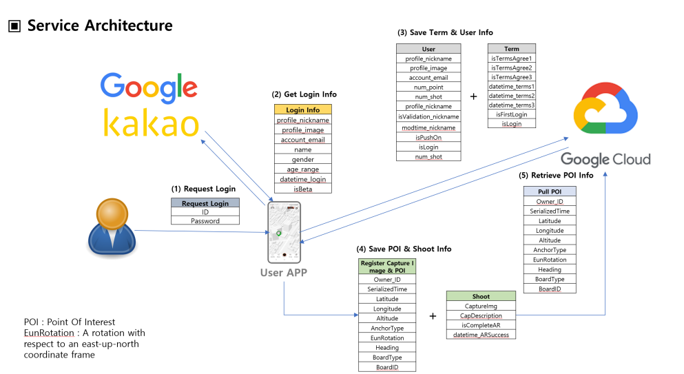
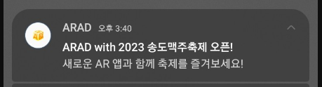

# AR로 즐기는 새로운 앱 테크 App

<h1 align="center">  </h1>

# 📌프로젝트 소개
### 언제든지 원하는 곳에 AR을 만들며 포인트를 얻어가자! ([Download URL](https://play.google.com/store/apps/details?id=com.anyractive.arad_january))

* ARAD 앱은 유저의 참여에 대한 보상을 제공하는 앱입니다.   
* 이벤트 AR 이미지가 생성된 곳에 촬영을 하면 포인트를 받을 수 있어요.  
* 유저들은 지급 받은 포인트로 상품권이랑 교환할 수 있습니다.   
* 쿠팡 파트너스 및 업체의 AR 광고를 통해 보다 뛰어난 마케팅 사업을 진행할 수 있습니다. 
 
 

# 🔎사용 기술
 

 
   
   
   

   
  

 

 

# 🎁서비스 아키텍쳐

 

# 🖥서버 통신
* <b>REST API 라이브러리</b> : Retrofit2 사용  

  

  ### 서버 ( 구글 클라우드 플랫폼 ) 
  1. 사용자의 회원가입 정보와 POI(관심지역정보) 저장 

  ### Android
  1. 서버와 http 통신으로 데이터를 교환 
  2. 데이터를 유니티 앱에 전달 
  3. 유니티 앱에서 송신한 데이터를 서버에 저장 

  ### Unity as a Library
  1. AR 컨텐츠를 실행하고 AOS앱에서 전달받은 결과 값 표출 
  2. 새로운 결과 값(POI)를 AOS앱에 전달  

# 주요 기능

## 1. 소셜 로그인
  구글 및 카카오 소셜 로그인
   

  | **구글 로그인** | **프로필 이미지 적용** | 
  |---|---|
  | " |  | 
 

## 2. AR 컨텐츠 실행(UaaL 사용)
 ### Uaal(Unity as a Library) :  Unity로 개발된 AR 앱을 AOS 네이티브 앱에 적용

### 1. ARCore Geospatial API 사용
  - 현재 위치의 정확도를 통해 Localization

### 2. 원하는 Plane에 마커 Object 생성
   - 터치를 통해 마커를 생성합니다.

### 3. 캡쳐 기능
   - 자신이 생성한 마커를 캡쳐할 수 있습니다.

       

### 4. 캡쳐 후, 마커 POI 정보 업로드
   - Unity as Library로 안드로이드 네이티브에 생성한 POI 정보를 전송합니다.

### 5. AR 실행 시, 저장된 POI 정보를 안드로이드 네이티브로부터 수신

### 6. 수신된 POI들은 웹뷰로 표현됩니다.
  
  

 - [Unity 모듈 연동]( https://velog.io/@romin1027/%EC%95%88%EB%93%9C%EB%A1%9C%EC%9D%B4%EB%93%9C%EC%97%90%EC%84%9C-Uaal-%ED%99%9C%EC%9A%A91) 
 안드로이드에 Unity 프로그램을 라이브러리로 활용 했습니다 
 

 

## 3. 데이터 서버 업로드

 사용자가 촬영한 이미지, 위치 정보, 촬영지 정보가 서버에 업로드 된 모습

  

## 4. 승인-반려 알림 전송
1. 사용자가 업로드한 이미지를 통해 관리자가 반려 or 승인 처리 
2. Client에게 알림 전송
  

  
안내 메시지를 받는 방법은 Push Token을 구글 파이어베이스를 통해 유저의 고유 푸시 token을 발급받고 Post Man과
자사 서버를 사용해 해당 기능을 구현 했습니다

  

# 결과 화면
 
<h1 align="center">

| **권한 요청** | **소셜 로그인** | **쿠팡 웹뷰** | **Main 화면** |
|---|---|---|---|
|  |  | | 

| **AR View1** | **AR View2** | **AR View3** | **POI Upload** | 
|---|---|---|---|
|  |  |  | 

 

# 추가 이미지
 

